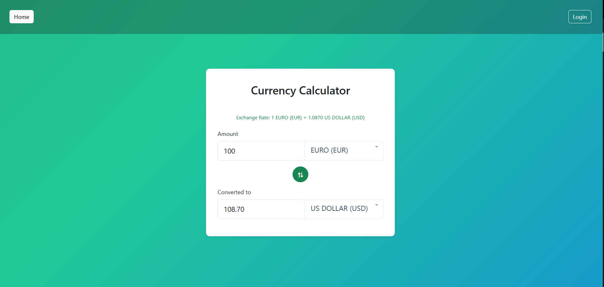
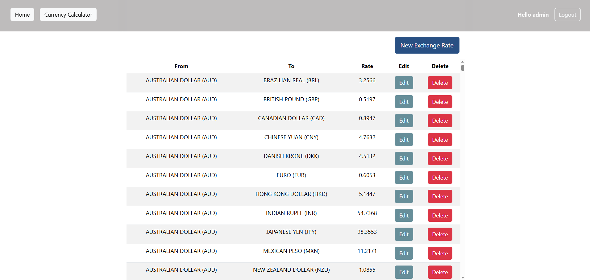

# Currency Calculator

A full-stack currency converter with a secured admin panel for managing exchange rates. Built with Vue 3, Node.js, Express.js and PostgrsSQL.

## 🌐 Live Demo

👉 **[Try the App](https://currency-calculator-sepia.vercel.app/)** 👈

## Demo Admin Credentials

- **Username:** `admin`
- **Password:** `currency1`

## Sceenshots






## ✨ Features

- 🔄 Convert between **20 currencies using 380 exchange rate pairs**
- 🔍 Searchable currency dropdowns
- 🔁 One-click currency swap
- 🔐 JWT-based admin authentication
- ⚙️ Protected admin panel with full CRUD operations
- 🔄 Automatic synchronization of reverse exchange rates
- ⏱️ Token expiration with auto-logout
- 🐳 Dockerized for easy local development

## 🛠️ Tech Stack

**Frontend:** Vue 3 (Composition API), Vue Router, Vite, Bootstrap 5, Axios  
**Backend:** Node.js, Express, JWT, Bcrypt  
**Database:** PostgreSQL (Supabase)  
**DevOps:** Docker, Docker Compose  
**Deployment:** Vercel, Render, Supabase

## 🚀 Local Setup

### Prerequisites

- [Docker Desktop](https://www.docker.com/products/docker-desktop/)

### Steps

```bash
# Clone the repository
git clone https://github.com/gretadr/currency_calculator.git
cd currency_calculator

# Run with Docker Compose
docker-compose up --build
```

Open your browser at:

```
http://localhost:8080
```

Backend API:

```
http://localhost:5000
```

## 🔌 API Endpoints

### Public

- `POST /api/auth/login` — Authenticate admin and receive a JWT token
- `GET /api/currencies` — Get all exchange rates
- `GET /api/currencies/:id` — Get a specific exchange rate
- `GET /api/convert?from=X&to=Y&amount=Z` — Convert an amount between currencies

### Protected (requires JWT)

- `POST /api/currencies` — Create a new exchange rate
- `PATCH /api/currencies/:id` — Update an existing exchange rate
- `DELETE /api/currencies/:id` — Delete an exchange rate

## 📌 Future Improvements

- 🌍 Support all world currencies
- 🔄 Automatic exchange rate updates using an external API
- 📈 Exchange rate history and charts
- 👥 Role-based authentication
- 🧪 Unit and integration testing

## 👩‍💻 Author

**Greta Dragoti**

[GitHub](https://github.com/gretadr) · [LinkedIn](https://linkedin.com/in/your-linkedin-profile)

---

⭐ If you find this project useful, please consider giving it a star!
